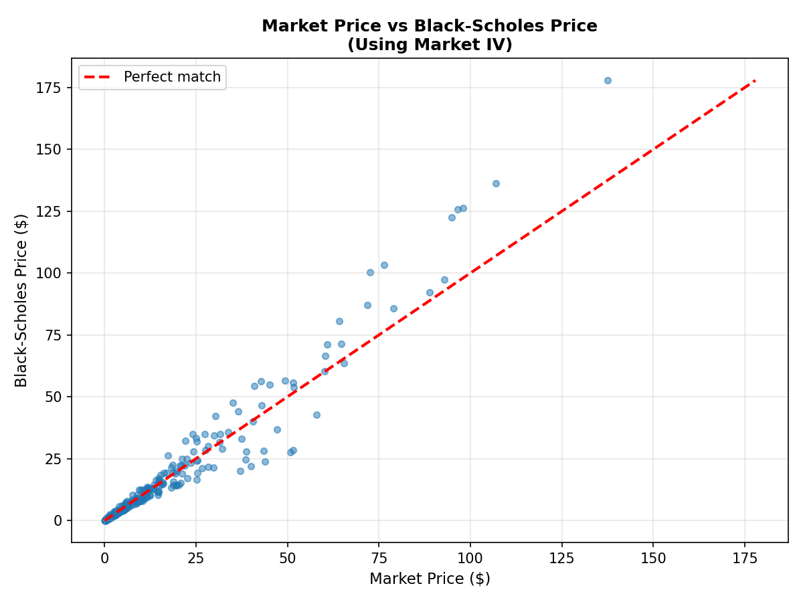
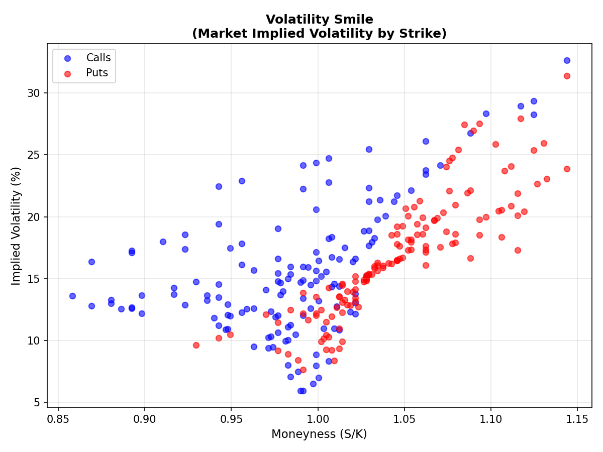
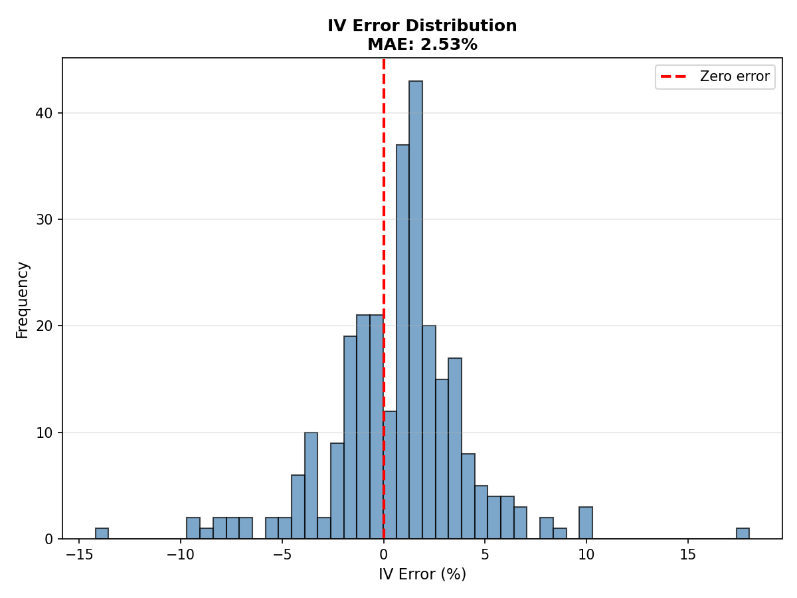

# Options Pricing & Implied Volatility Analysis

Learning project exploring derivatives pricing models and machine learning in quantitative finance. Built from an astrophysics background with no prior finance training.

## What I Built

Three classical option pricing models (Black-Scholes, Monte Carlo, Binomial Tree) implemented from scratch, plus a neural network to predict implied volatility (IV). All tested on real SPY (S&P 500 ETF) options data from Yahoo Finance.

Each method approaches the same problem differently - analytical solution, stochastic simulation, and discrete approximation. Wanted to see how different mathematical frameworks converge to the same answer.

## Project Structure

```
├── src/
│   ├── models/           # Three pricing implementations
│   ├── data/             # Download and clean market data
│   ├── ml/               # Neural network for IV prediction
│   └── analysis/         # Model comparisons
├── data/                 # Raw SPY options chains
└── results/              # Plots and trained models
```

## What I Learned

### 1. Financial Models Use Familiar Math

Coming from astrophysics, the equations looked familiar:

**Black-Scholes partial differential equation (PDE)** is the heat equation with drift. Stock price S evolves as:

∂V/∂t + ½σ²S²∂²V/∂S² + rS∂V/∂S - rV = 0

Change variables and this becomes the standard heat equation.

**Monte Carlo simulation** uses the same geometric Brownian motion I've seen in radiative transfer codes:

dS = μS dt + σS dW

Generate random price paths, calculate payoffs at expiration, average them. Exactly like Monte Carlo photon transport in radiative transfer calculations.

**Binomial tree** builds a lattice of possible future prices and works backwards from expiration. Similar to evolving hydrodynamic states in FLASH simulations, except in reverse time.

### 2. Real Data Requires Heavy Filtering

Downloaded 6,829 SPY option contracts, ended with 1,877 usable options after cleaning.

**Removed:**
- 313 expired contracts (time to expiration ≤ 0)
- 250 with bid-ask spreads >10% of price
- 1,652 with volume <10 contracts
- Options outside 0.85-1.15 moneyness range
- Implied volatility outliers (>200% or <1%)

**Total filtered: 4,952 contracts (72.5%)**

Can't compute reliable IV from illiquid options. Wide bid-ask spread means the market itself is uncertain about the price. Like trying to fit a spectrum with SNR < 2 - the data just isn't reliable enough.

### 3. Implied Volatility Inverts the Pricing Model

Standard direction: volatility σ → option price V

Implied volatility: option price V → volatility σ

Used Newton-Raphson with vega (∂V/∂σ) as the derivative. Converges in 5-10 iterations for most options because vega is always positive - option value increases monotonically with volatility.

**Key finding:** IV isn't constant across strike prices. Options away from at-the-money (ATM) show higher IV than near-the-money options. This "volatility smile" means the Black-Scholes constant-volatility assumption is wrong.

**Why the smile exists:** The model assumes log-normal price distribution (Gaussian in log-space). Real markets have fatter tails - extreme moves happen more often than Gaussian predicts. Out-of-the-money (OTM) options price in this tail risk with higher IV.

### 4. Three Models Converge to Same Answer

All three methods solve the same problem under identical assumptions:

**Black-Scholes:** Analytical solution to the PDE. Instant computation.

**Monte Carlo:** Simulated 500,000 random price paths (parallelized with joblib). Averaged payoffs at expiration. Achieved ~900k simulations/second.

**Binomial Tree:** Discrete lattice with backward induction. Converges to Black-Scholes as number of steps increases.

Validated on textbook examples - all three agree within $0.01 for identical inputs.

**Put-call parity verification:** For European options, the relationship C - P = S - Ke^(-rT) must hold by arbitrage. Tested on all liquid options, difference <$0.000001. This proves the implementation is correct.

### 5. Neural Network Results

Built feedforward network in PyTorch:
- Architecture: 3 inputs → 64 neurons → 32 → 16 → 1 output
- Inputs: moneyness (S/K), time to expiration, option type (call/put)
- Target: implied volatility
- Data split: 70% training, 15% validation, 15% test

Started with standard decreasing layer pattern (64→32→16) commonly used for regression tasks. Kept it simple since only 3 input features - deeper networks would likely overfit on this small feature set.

**Performance:** 1.17% mean absolute error (MAE) on test set.

My Newton-Raphson solver achieved 2.53% MAE. The network does better because it's learning from Yahoo Finance's IV calculations, which likely use more sophisticated methods than basic Newton-Raphson. The network approximates whatever model Yahoo Finance uses internally.

Real insight: IV has predictable structure based on just moneyness, time, and option type. Moneyness is likely the dominant feature - it directly drives the volatility smile pattern. Time to expiration matters for term structure (near-term vs long-term IV differences). Option type (call/put) has minimal impact since put-call parity means they share the same IV for identical strikes.

### 6. Limitations and Missing Pieces

**Single underlying:** Only tested on SPY. Model probably won't generalize to individual stocks with different volatility characteristics.

**Static snapshot:** One day's data. Haven't tested how IV surface evolves over time or across different market regimes (calm vs crisis periods).

**Basic features:** Only used moneyness, time, and option type. Could add historical realized volatility, VIX (market volatility index), or term structure patterns.

**European assumption:** Real SPY options are American (can exercise early), but priced them as European. Doesn't matter much for SPY since no dividend, but technically incorrect.

**No trading validation:** Didn't backtest whether model predictions would generate profit. That requires transaction costs, slippage, bid-ask impact - whole other complexity level.

## Technical Details

**Validation:**
- Tested against Hull's derivatives textbook examples
- Verified put-call parity (difference <$0.000001)
- Confirmed deep in-the-money options ≈ intrinsic value
- Checked binomial tree → Black-Scholes convergence

**Parallelization:**
Monte Carlo distributed price path simulations across CPU cores using joblib, similar to parallelizing hydrodynamic calculations.

**Neural network:**
- PyTorch implementation
- ReLU activation, dropout regularization
- StandardScaler preprocessing (zero mean, unit variance)
- MSE loss, Adam optimizer

## Results Summary

**Model agreement:**
- All three pricing methods converge within $0.01
- Put-call parity verified on all liquid options
- Newton-Raphson IV solver: 2.53% MAE vs market IV
- Neural network IV prediction: 1.17% MAE

**Final dataset:**
- 1,877 liquid options from 6,829 raw contracts
- Moneyness range: 0.85 - 1.15
- Expiration range: 2 to 839 days
- Spot price: $631.92 (October 3, 2024)

**Volatility surface patterns:**
- Clear smile: OTM options show higher IV than ATM
- Term structure: short-dated ~14% IV, long-dated ~18% IV
- Longer time = more uncertainty = higher option value

### Key Results

**Market Price vs Black-Scholes:**



Black-Scholes prices using market IV match actual market prices within $0.50 MAE. The model works well as a pricing framework when given correct volatility input.

**Volatility Smile:**



Clear smile pattern visible - options away from at-the-money show higher implied volatility. Calls and puts follow similar patterns. This confirms the Black-Scholes constant volatility assumption breaks down in real markets.

**IV Prediction Error Distribution:**



Newton-Raphson IV errors centered near zero with 2.53% MAE. Most errors within ±5%, showing the numerical method works reliably for liquid options.

## Potential Improvements

**Multi-asset training:** Test on different stocks and ETFs to check generalization.

**Time series analysis:** Collect daily data over months to study IV dynamics and regime changes.

**Better baseline:** Compare to industry models (SABR, SVI) instead of basic numerical solver.

**Feature engineering:** Add Greeks, historical volatility, market regime indicators.

**Trading validation:** Backtest with realistic transaction costs to see if predictions add value. Real application would require: (1) identifying when model IV differs from market IV, (2) executing spreads to capture mispricing, (3) accounting for transaction costs and bid-ask slippage. This model isn't ready for that - it learned from Yahoo Finance's own calculations, so it won't find true mispricings. Would need independent IV calculation or comparison to alternative models (SABR, local vol) to generate actual trading signals.

## Running the Code

```bash
# Install dependencies
pip install numpy pandas scipy matplotlib yfinance scikit-learn torch joblib

# Pipeline
python src/data/fetch_market_data.py      # Download SPY options
python src/data/clean_data.py              # Filter and clean
python src/data/compute_implied_vol.py     # Newton-Raphson IV calculation
python src/ml/vol_predictor.py             # Train neural network
python src/analysis/compare_methods.py     # Generate comparison plots
```

## References

- Black, F., & Scholes, M. (1973). The Pricing of Options and Corporate Liabilities
- Hull, J. (2018). Options, Futures, and Other Derivatives
- Cox, Ross, & Rubinstein (1979). Option Pricing: A Simplified Approach

---

**Note:** Learning project by someone with zero finance background. Implements standard textbook methods but hasn't been validated for real trading.
